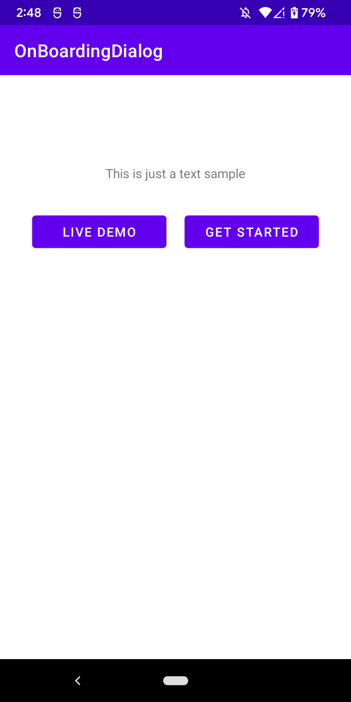
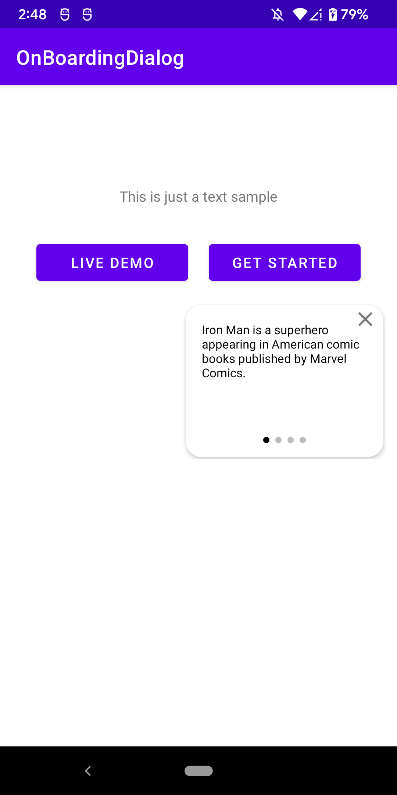
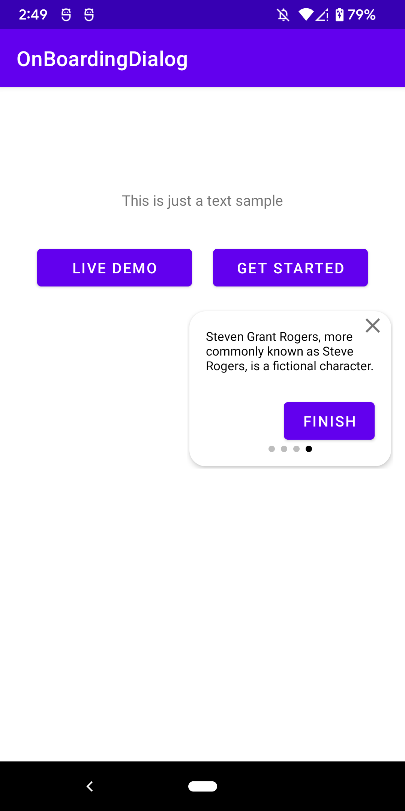

# OnBoardingDialog

### **Overview - About this project**
This is a simple App to demonstrate a Onboarding Dialog

### 📷 How is this App
</img>
</img>
</img>
</img>

https://www.youtube.com/shorts/TUuv2Lg4JHM

### 💻Technology
- [Kotlin](https://kotlinlang.org/)
 
### Donation
If this project help you reduce time to develop, you can buy me a cup of coffee :) 

